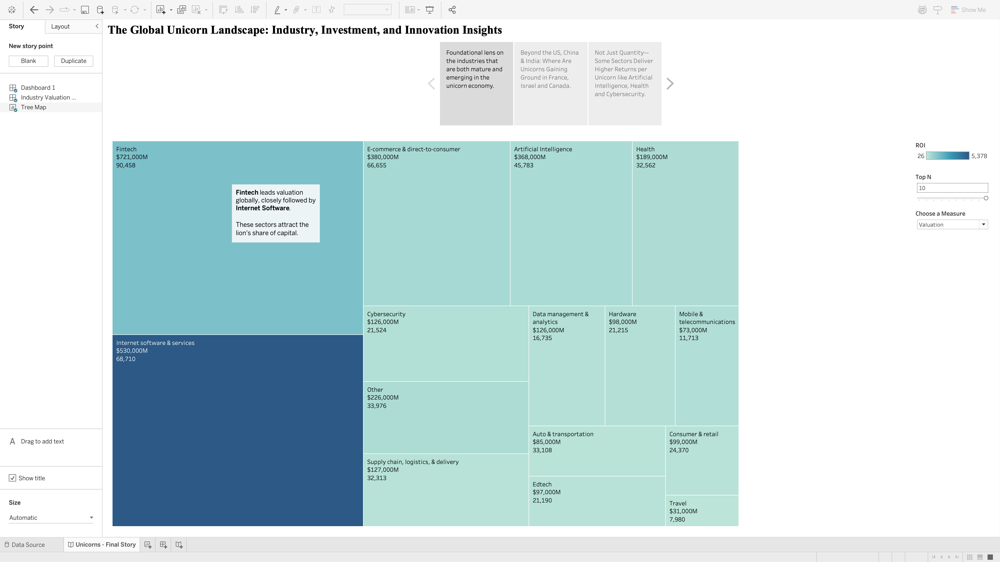
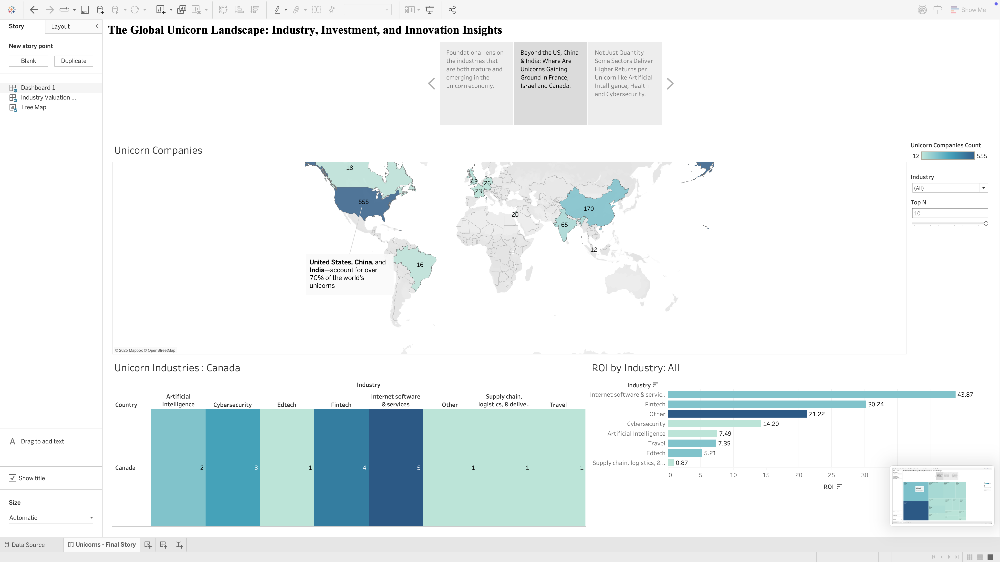
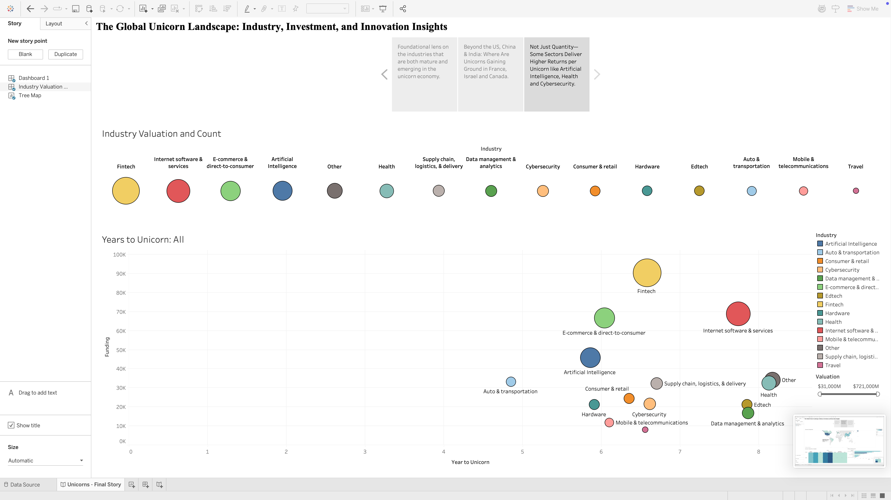

# The Global Unicorn Landscape: Industry, Investment, and Innovation Insights

## Project Overview
This project analyzes a dataset of unicorn startups (privately held companies valued at $1 billion or more) as of March 2022. As part of a team project for MSIS 2529 at Santa Clara University, I took full responsibility for creating the story component titled "The Global Unicorn Landscape: Industry, Investment, and Innovation Insights" - a comprehensive narrative that ties together our Tableau visualizations into a cohesive strategic analysis of the global unicorn ecosystem.

### 📊 [Watch My Data Story Presentation](https://youtu.be/I3uc__s9VpM)
*Click the link above to see my full presentation walking through the unicorn startup analysis and storytelling approach.*

## Team
- Derleen Saini 
- **Ritika Verma** (Story Creator & Lead Analyst for "The Global Unicorn Landscape" narrative)
- Ria Kalluri
- Anya Rajan
- Sayali Borate

*Santa Clara University - Leavey School of Business (MSIS 2529, Group 5)*

## Project Dataset
Our analysis used a comprehensive dataset of unicorn startups as of March 2022, containing:
- Company names and founding years
- Industries and business models
- Valuations and funding amounts
- Countries of origin
- Year each company achieved unicorn status
- Select investor information

## My Story: The Global Unicorn Landscape

As the creator of the project's story component, I developed a comprehensive analytical narrative titled "The Global Unicorn Landscape: Industry, Investment, and Innovation Insights." My story framework ties together multiple visualizations through a cohesive analytical lens that highlights three key dimensions of the unicorn ecosystem:

### 1. Industry Distribution (Tree Map Visualization)

In this visualization, I showcased how:
- **Fintech leads the global landscape** with $723,000M in valuation across 90,458 companies
- **Internet Software & Services** follows closely with $530,000M in valuation across 68,710 companies
- These sectors attract "the lion's share of capital" while emerging sectors like Artificial Intelligence ($368,000M) signal the diversification of innovation

My narrative explained how this distribution reflects both mature sectors and emerging innovation areas, providing stakeholders with insights into where capital is flowing and why.

### 2. Geographic Concentration (World Map Visualization)

This visualization revealed:
- The "70% Phenomenon" - United States (555 unicorns), China (170), and India account for over 70% of the world's unicorns
- Emerging hubs in countries like Canada, where I highlighted specialized industry concentrations
- ROI variations by region, showing which countries deliver the most efficient returns on investment

My analysis focused on how this geographic distribution reflects both established innovation hubs and emerging markets poised for growth.

### 3. Valuation Efficiency (Bubble Chart)

This sophisticated visualization mapped:
- Funding levels against time-to-unicorn status across industries
- How sectors like Fintech lead in raw valuation (reaching 100K) while taking 7+ years to unicorn status
- The efficiency of sectors like Artificial Intelligence, which shows strong valuation (40K+) with moderate time-to-unicorn ratios

My narrative contextualizes these patterns by explaining how different sectors demonstrate varying capital efficiency and growth trajectories.

### Synthesis and Storytelling Approach

I crafted a cohesive narrative that guided viewers through these visualizations, emphasizing:

1. The dominance of traditional tech sectors while highlighting emerging areas of innovation
2. The global concentration of unicorns while identifying new regional growth patterns
3. The relationship between funding, valuation, and time-to-unicorn across industries

My storytelling approach transformed complex data patterns into strategic insights for investors, entrepreneurs, and policymakers by focusing on the "why" behind the patterns rather than just describing what's visible in the visualizations.

## Repository Contents
- `visualizations/`: Screenshots of my Tableau story visualizations
- `report/`: The final project report showcasing my story component
- `data/`: Dataset used for analysis
- `dashboard/`: Dashboards and Story file created

## Skills Demonstrated
- **Advanced Data Storytelling**: Transformed complex data patterns into a compelling narrative with clear business implications
- **Strategic Business Analysis**: Identified non-obvious patterns and challenged common assumptions about the unicorn ecosystem
- **Executive Presentation Skills**: Crafted a concise, impactful presentation script that guides viewers through complex data patterns
- **Visual Design & Communication**: Developed a three-part framework that makes complex analysis accessible to diverse stakeholders
- **Market Insight Development**: Derived actionable insights for investors, entrepreneurs, and policymakers

## Impact & Reception
My data storytelling approach was well-received for several reasons:

1. **From Data to Strategy**: Rather than simply describing charts, I connected industry patterns, geographic trends, and valuation metrics into a strategic framework that delivers actionable insights.

2. **Narrative Structure**: My three-part structure (Industry Distribution → Geographic Concentration → Valuation Efficiency) created a logical progression that builds understanding while maintaining viewer engagement.

3. **Insight Development**: I went beyond observable patterns to highlight counter-intuitive findings, such as how sectors with fewer unicorns often demonstrate higher capital efficiency and better ROI.

4. **Executive Synthesis**: My concluding synthesis distilled complex patterns into a clear, memorable takeaway about where the next wave of unicorns might emerge.

This project showcases my ability to transform data analysis into strategic business narrative - a critical skill at the intersection of data science, business strategy, and executive communication.